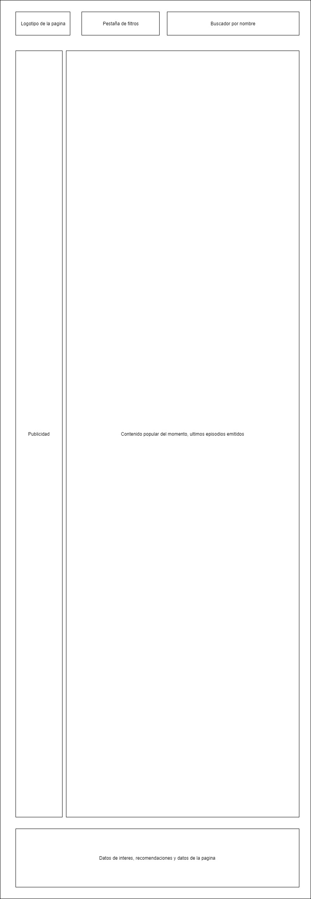
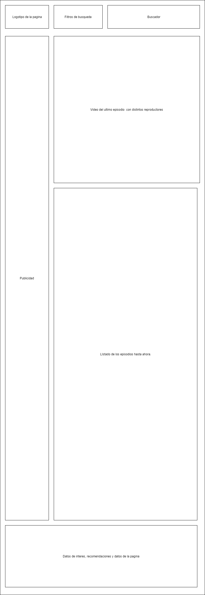
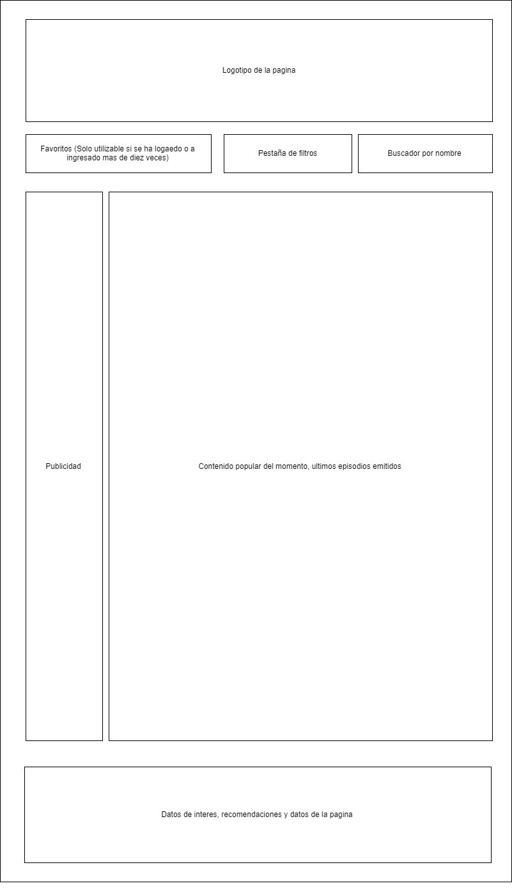
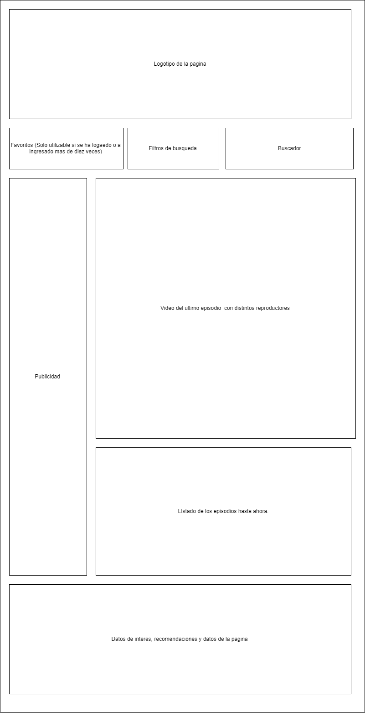

# FlixAttack
## Descripcion del proyecto

Pagina web inspirada en pagina de visualizacion de series online, con colaboracion de usuarios registrados.

## Perfiles de usuario

| Descripcion | enlaces | Observaciones |
|--------|--------|--------|
|     Github   |   [https://github.com/idpalejandrogarcia](https://github.com/idpalejandrogarcia)     |    Mi perfil de github    |
|     Codepen   |    [https://codepen.io/raxes/#](https://codepen.io/raxes/#)    |     Mi perfil de codepen   |
|    Twitter    |     [https://twitter.com/raxesforged](https://twitter.com/raxesforged)   |    Mi cuenta de twitter    |
|     Proyecto   |    [https://idpalejandrogarcia.github.io/flixattack/](https://idpalejandrogarcia.github.io/flixattack/)    |   Mi proyecto     |

##Herramientas utilizadas

1. Draw.io: [https://www.draw.io/](https://www.draw.io/)
2. Trello: [https://trello.com/](https://trello.com/)
3. Atom: [https://atom.io/](https://atom.io/)
4. Caniuse: [https://caniuse.com/](https://caniuse.com/)
5. geany :[https://www.geany.org/](https://www.geany.org/)

## Fase 1: Boceto inicial de la pagina.

## Fase 2: Cambios en el boceto inical
###### Se ha añadido el menu favoritos y se a reducido considerablemente el tamaño de la pagina

