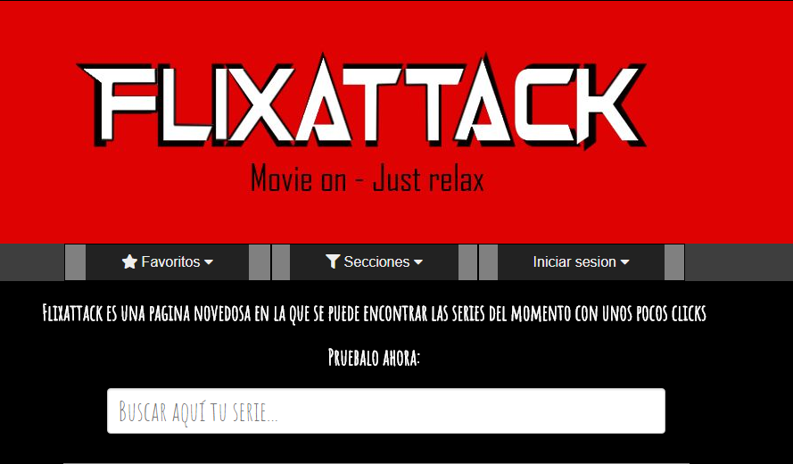
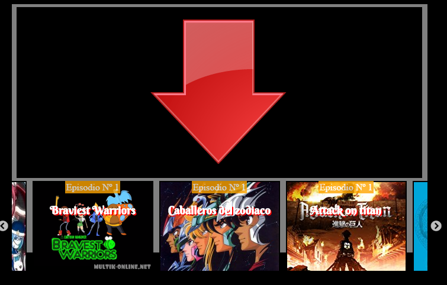
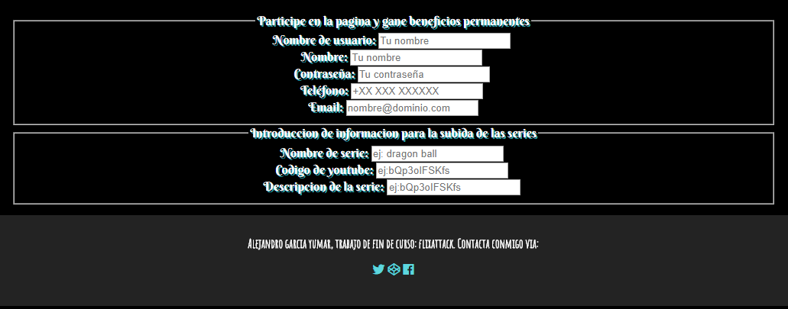

# FlixAttack

## Descripcion del proyecto

Pagina web inspirada en pagina de visualizacion de series online, con colaboracion de usuarios registrados.

## Perfiles de usuario

| Descripcion | enlaces | Observaciones |

|--------|--------|--------|

|     Github   |   [https://github.com/idpalejandrogarcia](https://github.com/idpalejandrogarcia)     |    Mi perfil de github    |

|     Codepen   |    [https://codepen.io/raxes/#](https://codepen.io/raxes/#)    |     Mi perfil de codepen   |

|    Twitter    |     [https://twitter.com/raxesforged](https://twitter.com/raxesforged)   |    Mi cuenta de twitter    |

|     Proyecto   |    [https://idpalejandrogarcia.github.io/flixattack/](https://idpalejandrogarcia.github.io/flixattack/)    |   Mi proyecto     |

##Herramientas utilizadas

1. Draw.io: [https://www.draw.io/](https://www.draw.io/)

2. Trello: [https://trello.com/](https://trello.com/)

3. Atom: [https://atom.io/](https://atom.io/)

4. Caniuse: [https://caniuse.com/](https://caniuse.com/)

5. geany :[https://www.geany.org/](https://www.geany.org/)

6. Haroopad:[http://pad.haroopress.com/](http://pad.haroopress.com/)

7. github:[https://github.com/](https://github.com/)

8. Greenshot:[http://getgreenshot.org/](http://getgreenshot.org/)

9. Inkscape: [https://inkscape.org/es/](https://inkscape.org/es/) 

10. Favicon: [https://realfavicongenerator.net/](https://realfavicongenerator.net/)
11. Fontawesome: [http://fontawesome.io/](http://fontawesome.io/ )  

## Fase 1: Boceto inicial de la pagina.

## Fase 2: Cambios en el boceto inical

###### Se ha añadido el menu favoritos y se a reducido considerablemente el tamaño de la pagina

## Fase 3: Cambios finales a la pagina y posibles cambios futuros.

###### Se ha cambio detalles desde el diseño anterior, como la colocacion del buscador, se elimino el boton de filtros y se cambio por el de secciones; y el lugar que ocupaba el buscador fue cambiado por un boton de inicio de sesion para futura implementacion de una base de datos.

###### Se ha implementado un carrucel desde el que se puede seleccionar un video previamente colocado en youtube e implementado en json con el que a partir de una funcion implanta datos en el carrucel; y desde el que le indicamos que video y fondo debe colocar en cada momento.

###### Por ultimo se implemento un formulario en el que se pedira el nombre de usuario y algunos datos de contacto, los cuales se usaran en el momento de implementar  usarios colaborativos. Este ultimo detalle se usara para seguir aumentando la cantidad de contenido de la pagina mediante la colaboracion de usuarios previamente registrados.

###### Se ha incluido tambien un pequeño logotipo a la pagina para que sea visible en cualquier dispositivo.

